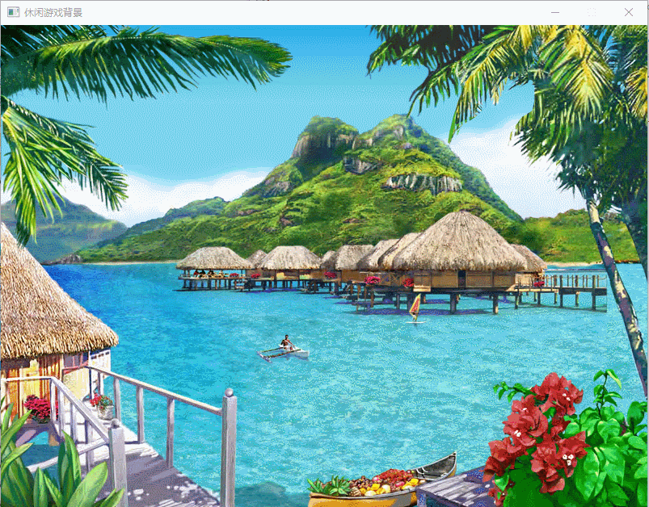
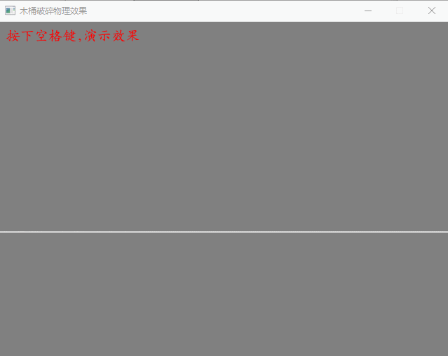
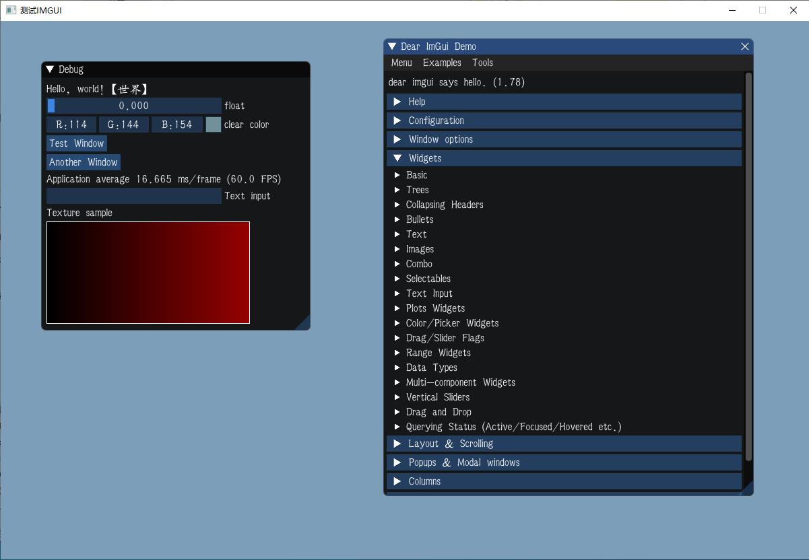
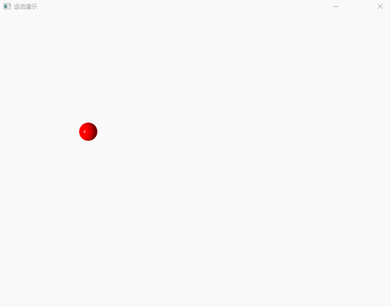
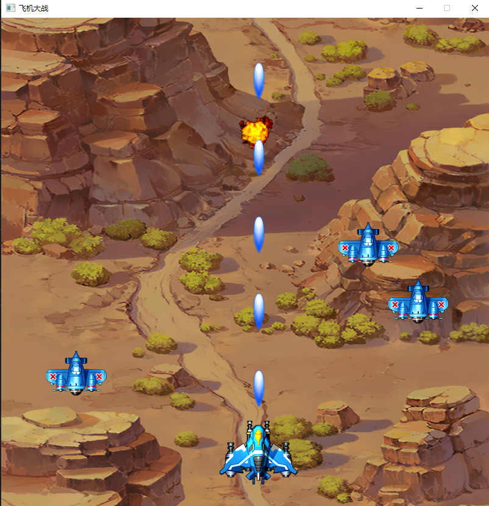
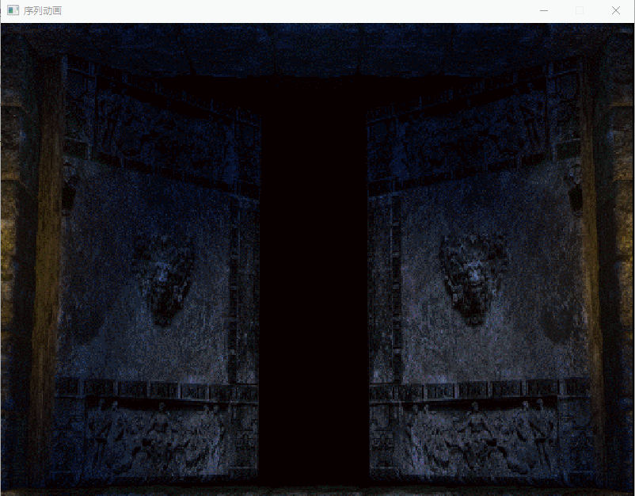
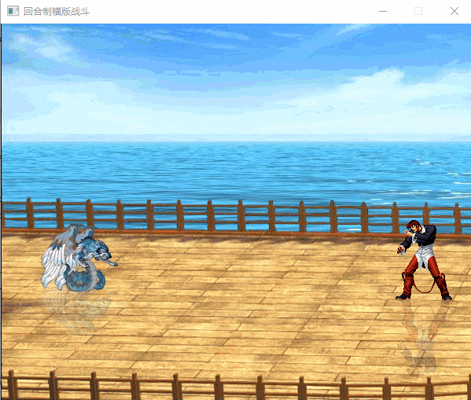

LoveSharp Demo

## Introduction
The LoveSharp library I modified supports .net 8.0 nativeaot compilation and only supports the windows platform.

## Runtime Environment
* .net8.0 
* Windows10 

## Compiler Environment
* Visual Studio 2022 Preview

## Reference
* https://github.com/endlesstravel/Love2dCS

## Demo
### ProjectCasualGames:  

### ProjectCrush:  

### ProjectDumgeon:  

### ProjectImGui:  

### ProjectMotion:  

### ProjectPlaneWar:  

### ProjectSequenceAnimation:  

### ProjectTurnbase:  

### ProjectTiledMap:  
