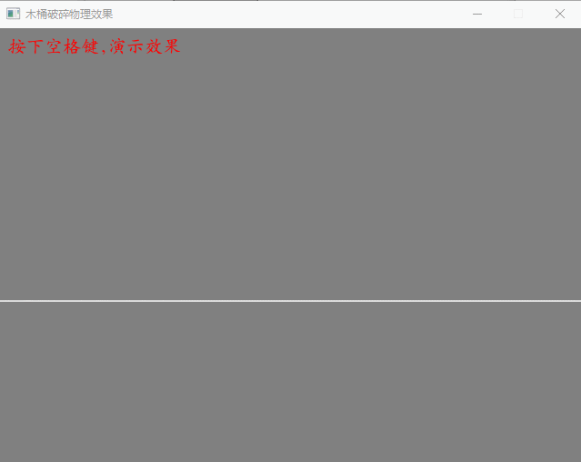
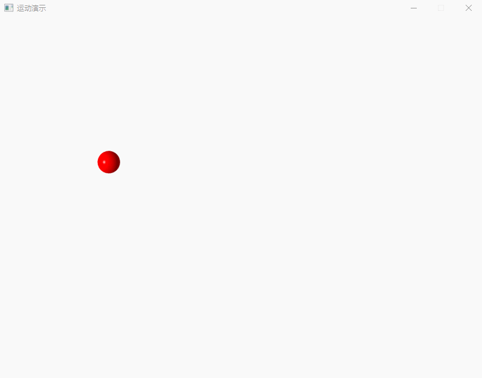
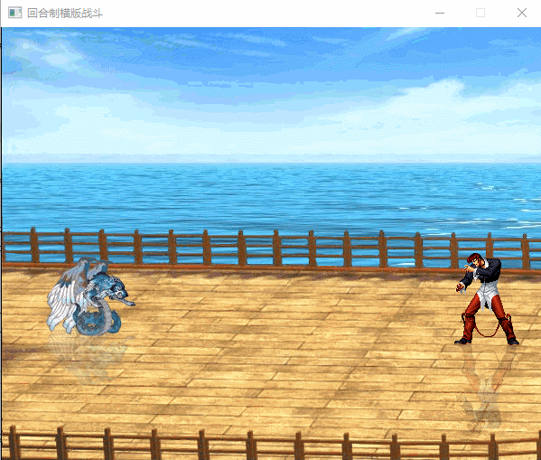

LoveSharp Demo

## 说明
我修改的LoveSharp库支持.net 8.0 nativeaot编译，仅支持windows平台。

## 运行环境
* .net8.0 
* Windows10 

## 编译环境
* Visual Studio 2022 Preview

## 参考
* https://github.com/endlesstravel/Love2dCS

## 例子
### ProjectCasualGames:  

### ProjectCrush:  

### ProjectDumgeon:  

### ProjectImGui:  

### ProjectMotion:  

### ProjectPlaneWar:  

### ProjectSequenceAnimation:  

### ProjectTurnbase:  

### ProjectTiledMap:  
